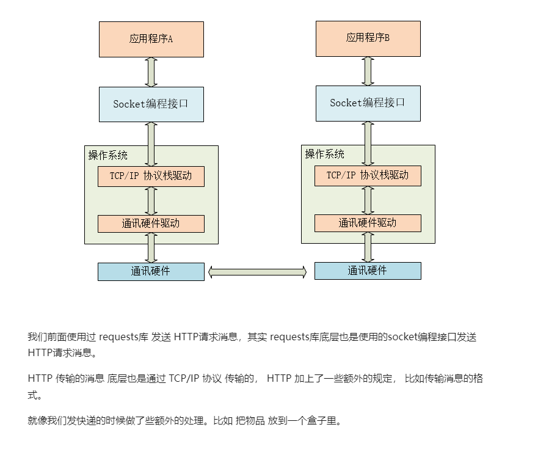

# python socket 学习笔记


# 1. TCP通信和IP通信简介和原理



# 2. 客户端和服务端实例

client.py

```python
#  === TCP 客户端程序 client.py ===

from socket import *

IP = '127.0.0.1'
SERVER_PORT = 50000
BUFLEN = 1024

# 实例化一个socket对象，指明协议
dataSocket = socket(AF_INET, SOCK_STREAM)

# 连接服务端socket
dataSocket.connect((IP, SERVER_PORT))

while True:
    # 从终端读入用户输入的字符串
    toSend = input('>>> ')
    if  toSend =='exit':
        break
    # 发送消息，也要编码为 bytes
    dataSocket.send(toSend.encode())

    # 等待接收服务端的消息
    recved = dataSocket.recv(BUFLEN)
    # 如果返回空bytes，表示对方关闭了连接
    if not recved:
        break
    # 打印读取的信息
    print(recved.decode())

dataSocket.close()
```


server.py

```python
#  === TCP 服务端程序 server.py ===

# 导入socket 库
from socket import *

# 主机地址为空字符串，表示绑定本机所有网络接口ip地址
# 等待客户端来连接
IP = ''
# 端口号
PORT = 50000
# 定义一次从socket缓冲区最多读入512个字节数据
BUFLEN = 512

# 实例化一个socket对象
# 参数 AF_INET 表示该socket网络层使用IP协议
# 参数 SOCK_STREAM 表示该socket传输层使用TCP协议
listenSocket = socket(AF_INET, SOCK_STREAM)

# socket绑定地址和端口
listenSocket.bind((IP, PORT))


# 使socket处于监听状态，等待客户端的连接请求
# 参数 8 表示 最多接受多少个等待连接的客户端
listenSocket.listen(8)
print(f'服务端启动成功，在{PORT}端口等待客户端连接...')

dataSocket, addr = listenSocket.accept()
print('接受一个客户端连接:', addr)

while True:
    # 尝试读取对方发送的消息
    # BUFLEN 指定从接收缓冲里最多读取多少字节
    recved = dataSocket.recv(BUFLEN)

    # 如果返回空bytes，表示对方关闭了连接
    # 退出循环，结束消息收发
    if not recved:
        break

    # 读取的字节数据是bytes类型，需要解码为字符串
    info = recved.decode()
    print(f'收到对方信息： {info}')

    # 发送的数据类型必须是bytes，所以要编码
    dataSocket.send(f'服务端接收到了信息 {info}'.encode())

# 服务端也调用close()关闭socket
dataSocket.close()
listenSocket.close()
```


