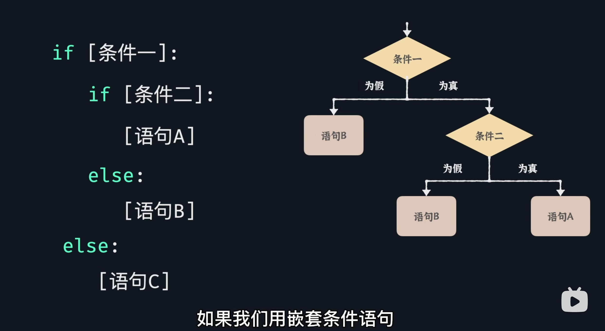
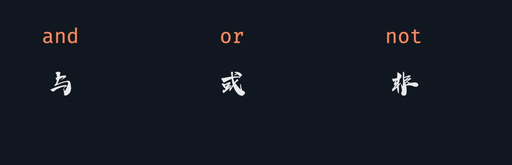
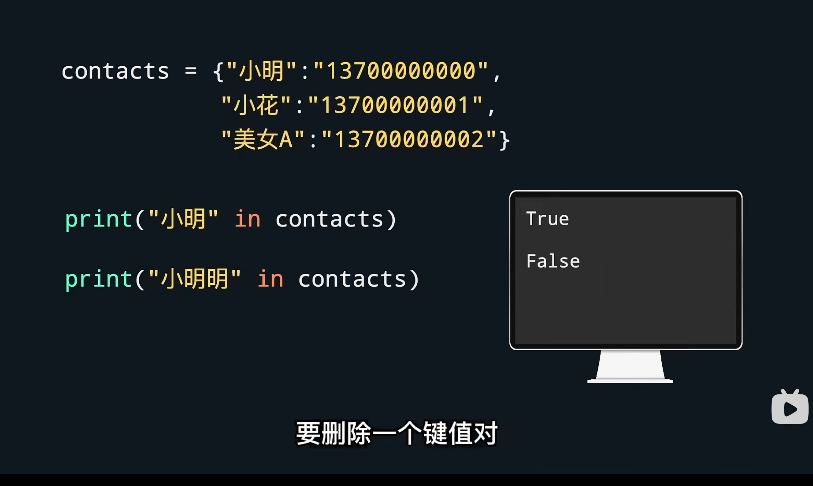
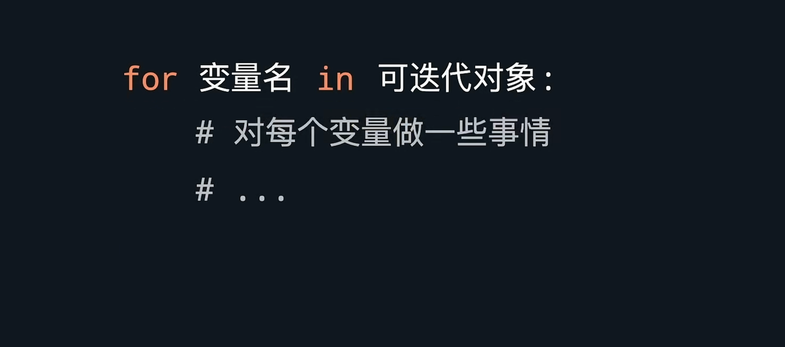
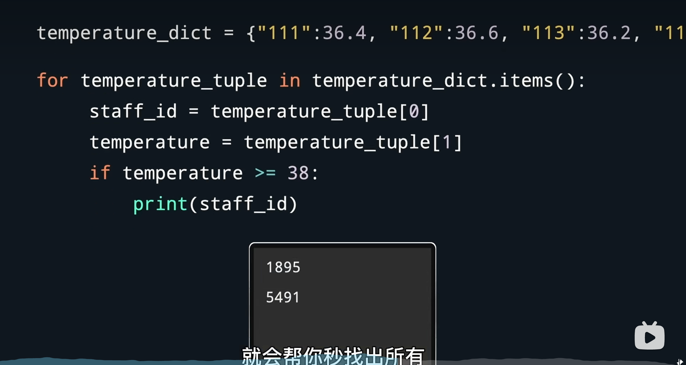
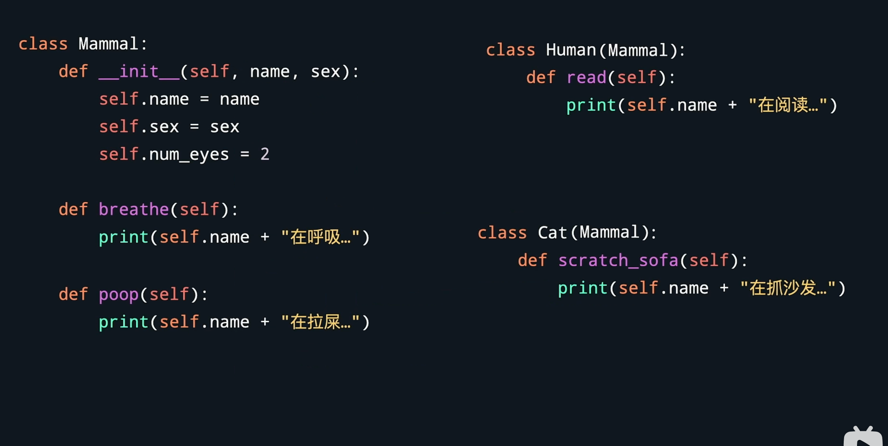

# 1.变量


## 1.下划线命名法


下划线命名法：

1. 字母全部小写
2. 不停单词用下划线分割


驼峰命名法

1. 单词首字母大写分割

   Userage

   UserGender


# 2. 条件判断：


 if [] :





4 个空格的缩进





and   &&

or || 

# 3. 列表


```python
shopping_list = ["'见面'"]
shopping_list.append("'牵手'")  # 添加元素
shopping_list.remove("见面")
```


同一个列表里面可以放不同的数据


## 1. 列表内置函数


## 2 实例操作，购物清单


## 3 函数和方法的区别


# 4. 字典

## 字典用于储存键值对


## 字典和列表都是可变的


## 增加元素


## 判断键是否存在





## 删除键值对


del  字典名 [ 键]


## 内置方法


## 元组


列表用方括号

元组用元括号，元组不可变，增删改都不能使用

# 5. for循环





## 1. 示例1


```python
temperature_list = [36.4,36.6,36.2]
for temperature in temperature_list:
    if temperature >=38:
        print(temperature)
        print("完球了")
```


## 2. 示例2





上面两个意思相同


## 3. range(a,b)


range(5,10)

结束值不在序列中


## 4. range(a,b,c)


# 6. while循环


## 1. 语法


## 2.while 和for 的区别


##  3. 实例


```python
print ("'此为一个求平均值的程序'")
total = 0
count = 0 
user_input = input ("请输入数字（完成所有数字输入后，请输入q结束程序）")
while user_input!="q" :
    num = float (user_input)
    total+=num
    count=count+1
    user_input = input ("请输入数字（完成所有数字输入后，请输入q结束程序）")

if count==0:
    result=0
    print("你输入的值的平均值为"+ str(result)) 
else:
    result=total/count
   print("你输入的值的平均值为"+ str(result)) 
    
    


```

# 7. 格式化字符串

## 1. format 方法


# 8. 函数

## 1. 格式


​	


# 9. 引入模块

​	

## 1. 书写规则


按住ctrl  点函数名，就可以查看函数内容


## 2. 引入第三方库


​	


# 10. 面向对象


## 1. 类方法和属性


## 2. 类继承


在 class 类上(父类)



